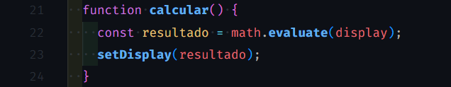
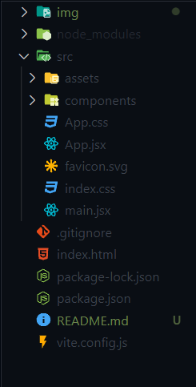

### Calculadora ReactJS
<a href="https://calculadora-react-psi.vercel.app/">Link do projeto</a>

Esse projeto foi feito visando a consolidação dos conhecimentos básicos de ReactJS.

Para está construção foram usados os conceitos de states, props, components e stylesheet (flex e grid). Utilizando do conceito de calculadora com mudança de temas (dark e light).

Utilizando o mathjs para os cálculos matemáticos, vite para a criação do boilerplate.

  

Para cálculos matemáticos foi utilizado o mathjs pois ele possui uma função muito útil de interpretar strings e gerar a evaluate da expressão aritmética. Algo muito próximo da matemática simbólica na computação.

Para a boilerplate foi utilizado o vitejs pois ele faz um uso melhor das tecnologias implementadas no navegador, como o esquema de módulos, possui muito menos arquivos na sua criação inicial do boilerplate. O que não gera o desconforto e a poluição visual que o seu antecessor "create-react-app" fazia.

    

<a href="https://calculadora-react-psi.vercel.app/">Link do projeto</a>

    <h4>Calculadora Calculando</h4>
    
    <h4>Tema Dark</h4>
    
    <h4>Tema Light</h4>
    

